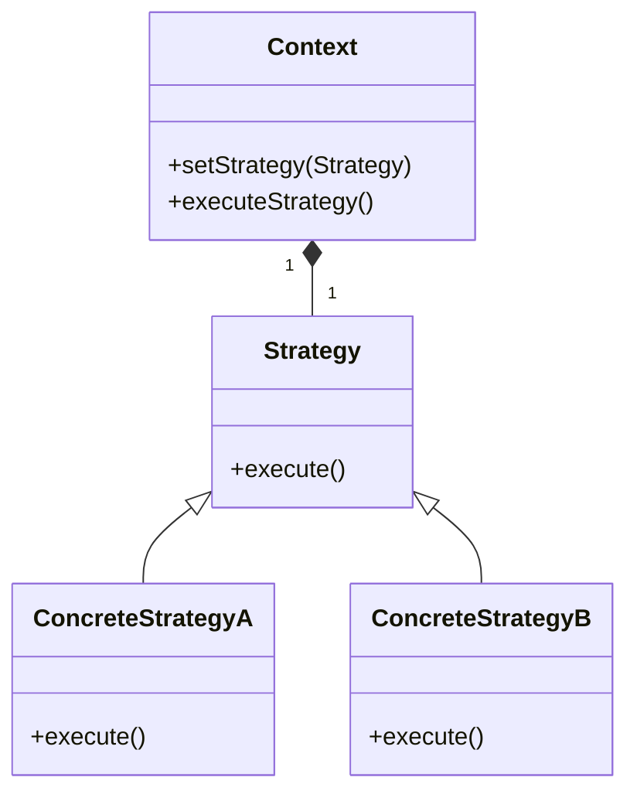
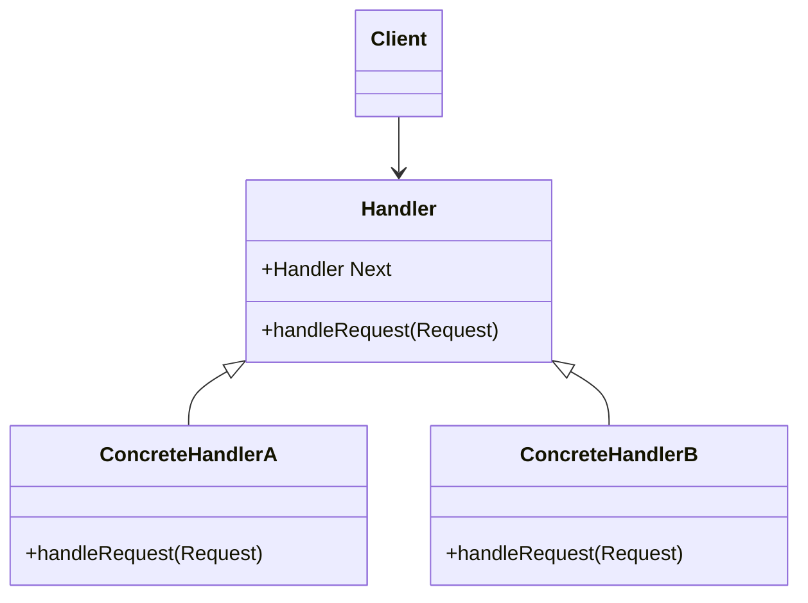
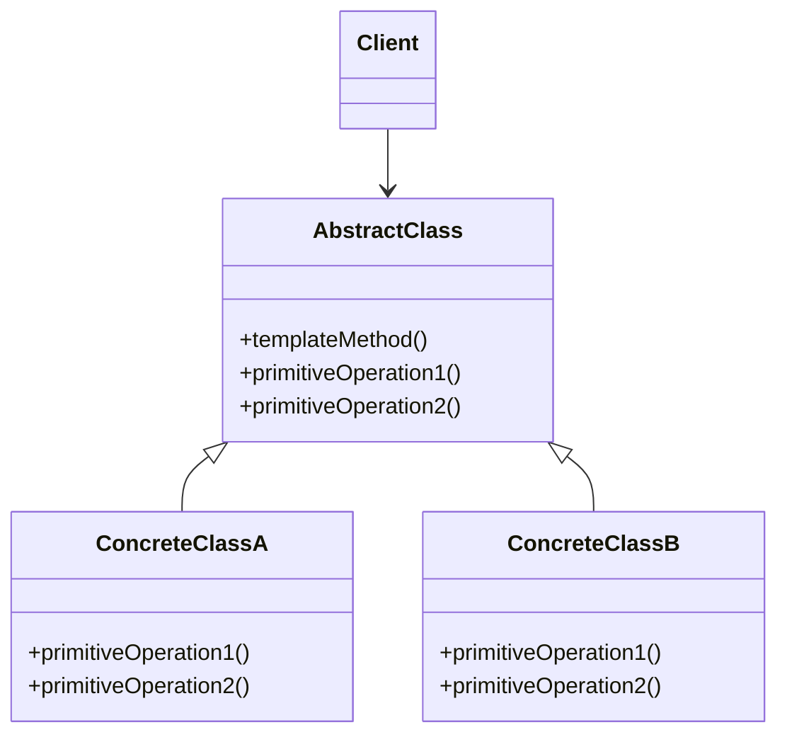
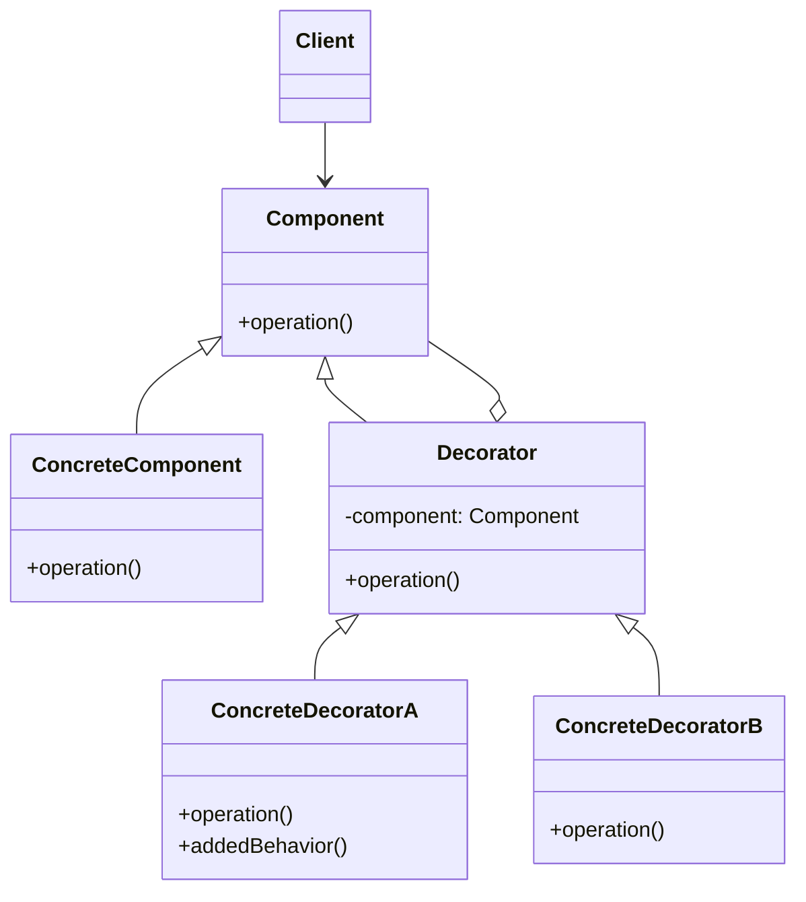
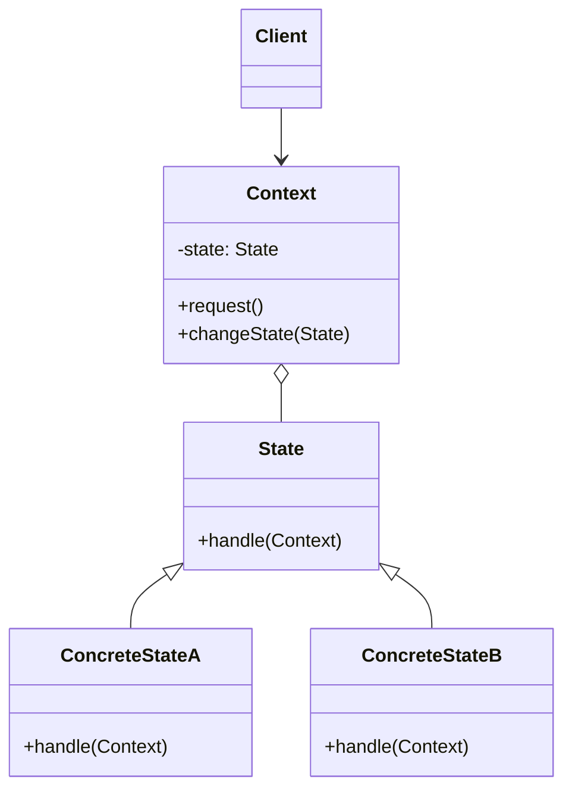
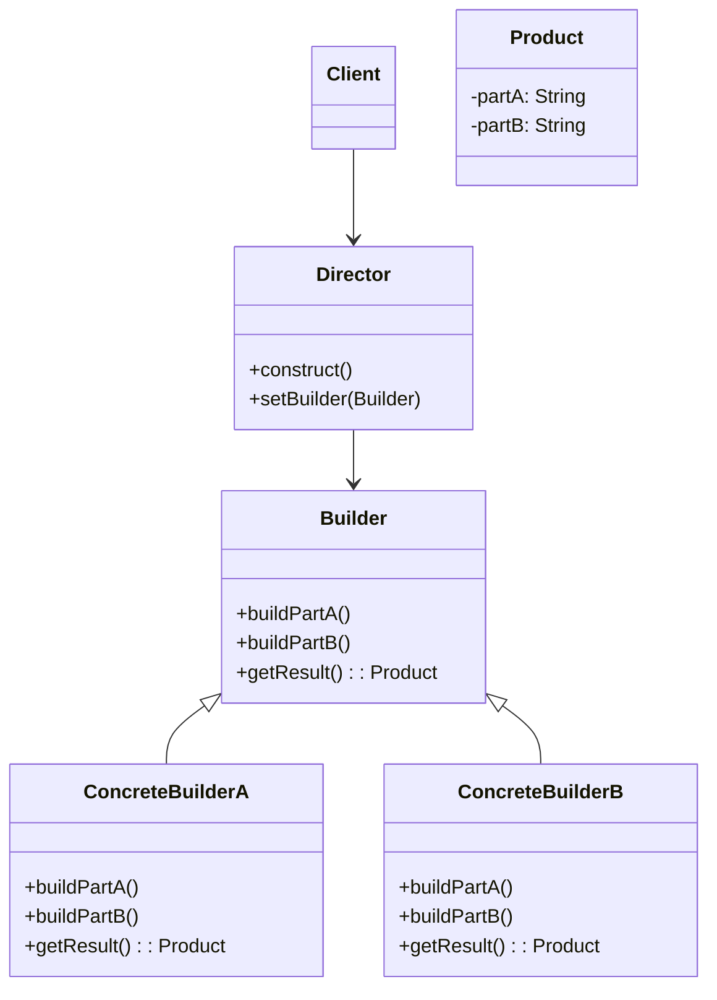
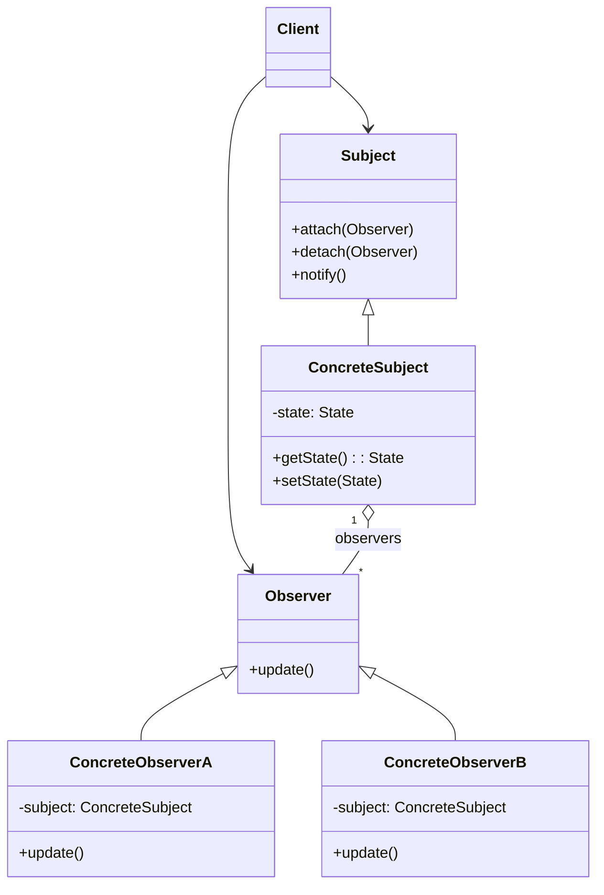
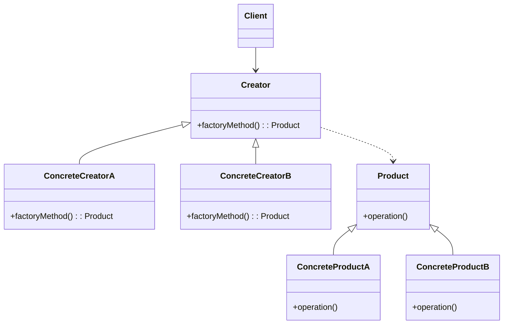

# STRATEGY

The Strategy Design Pattern is a behavioral design pattern that allows you to define a family of algorithms, encapsulate each one, and make them interchangeable. This pattern enables the algorithms to vary independently from the clients that use them, promoting loose coupling and flexibility in code.

# CHAIN OF RESPONSABILITY

The Chain of Responsibility Design Pattern is a behavioral design pattern that allows you to decouple the sender of a request from its receivers by giving multiple objects a chance to handle the request. The pattern establishes a chain of objects (handlers) that can process the request. The request is passed along the chain until one of the handlers processes it, or the end of the chain is reached.

# TEMPLATE METHOD

The Template Method Design Pattern is a behavioral design pattern that defines the skeleton of an algorithm in an operation, deferring some steps to subclasses. The pattern allows subclasses to redefine certain steps of an algorithm without changing the overall structure and sequence of the algorithm.

# DECORATOR

The Decorator Design Pattern is a structural design pattern that allows you to add new functionality to an existing object without altering its structure. This pattern involves a set of decorator classes that are used to wrap concrete components. Decorator classes mirror the type of the components they are decorating but add or override behavior.

# STATE

The State Design Pattern is a behavioral design pattern that allows an object to change its behavior when its internal state changes. The pattern encapsulates state-specific behavior into separate classes and delegates the state-related tasks to the corresponding objects.

# BUILDER

The Builder Design Pattern is a creational design pattern that separates the construction of a complex object from its representation. It allows the same construction process to create different representations of the object. This pattern is particularly useful when you need to create complex objects with many parts or configurations.

# OBSERVER

The Observer Design Pattern is a behavioral design pattern that defines a one-to-many dependency between objects so that when one object (the Subject) changes its state, all its dependents (the Observers) are notified and updated automatically. This pattern promotes loose coupling between the Subject and the Observers.

# FACTORY METHOD

The Factory Method Design Pattern is a creational design pattern that provides an interface (or abstract class) for creating objects in a superclass, but allows subclasses to alter the type of objects that will be created. This pattern promotes loose coupling between the creator and the concrete products.

