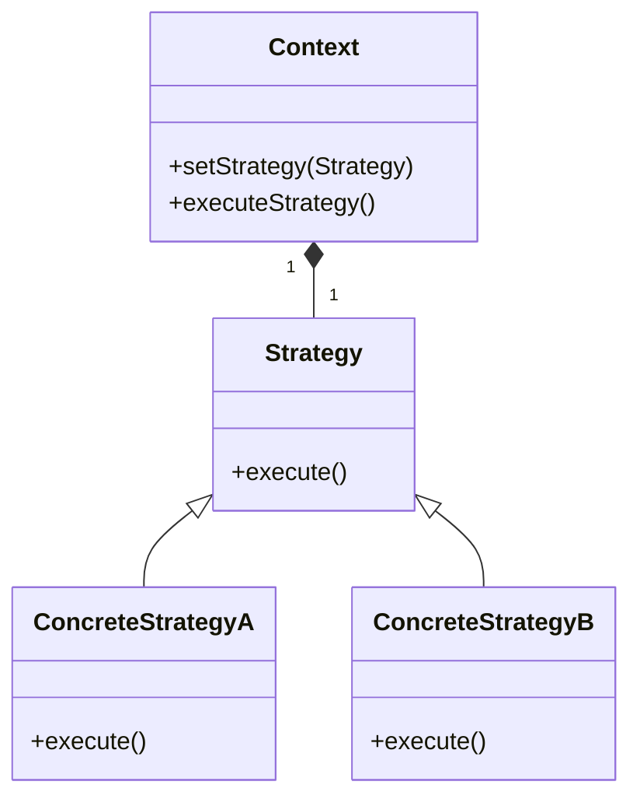
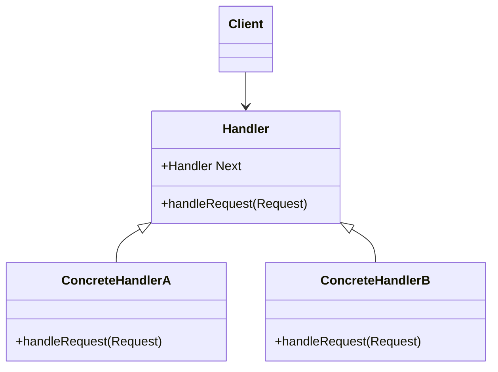
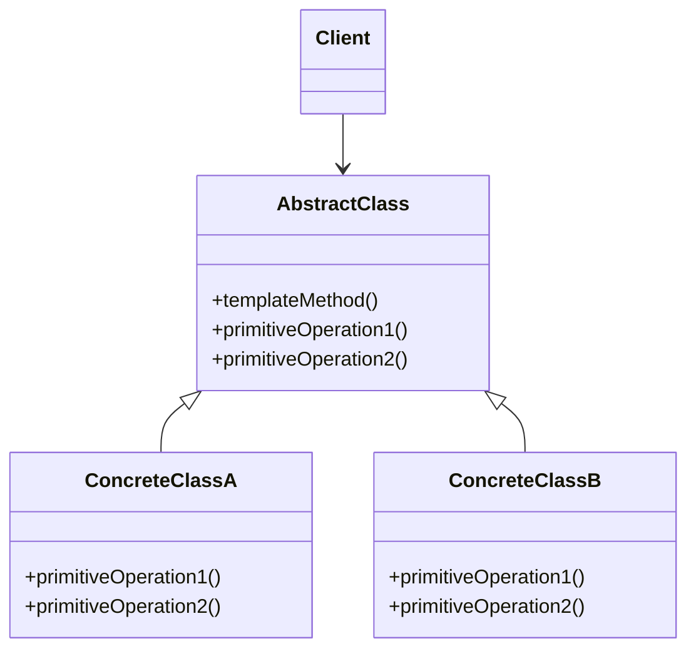

# STRATEGY

The Strategy Design Pattern is a behavioral design pattern that allows you to define a family of algorithms, encapsulate each one, and make them interchangeable. This pattern enables the algorithms to vary independently from the clients that use them, promoting loose coupling and flexibility in code.

# CHAIN OF RESPONSABILITY

The Chain of Responsibility Design Pattern is a behavioral design pattern that allows you to decouple the sender of a request from its receivers by giving multiple objects a chance to handle the request. The pattern establishes a chain of objects (handlers) that can process the request. The request is passed along the chain until one of the handlers processes it, or the end of the chain is reached.

# TEMPLATE METHOD

The Template Method Design Pattern is a behavioral design pattern that defines the skeleton of an algorithm in an operation, deferring some steps to subclasses. The pattern allows subclasses to redefine certain steps of an algorithm without changing the overall structure and sequence of the algorithm.

