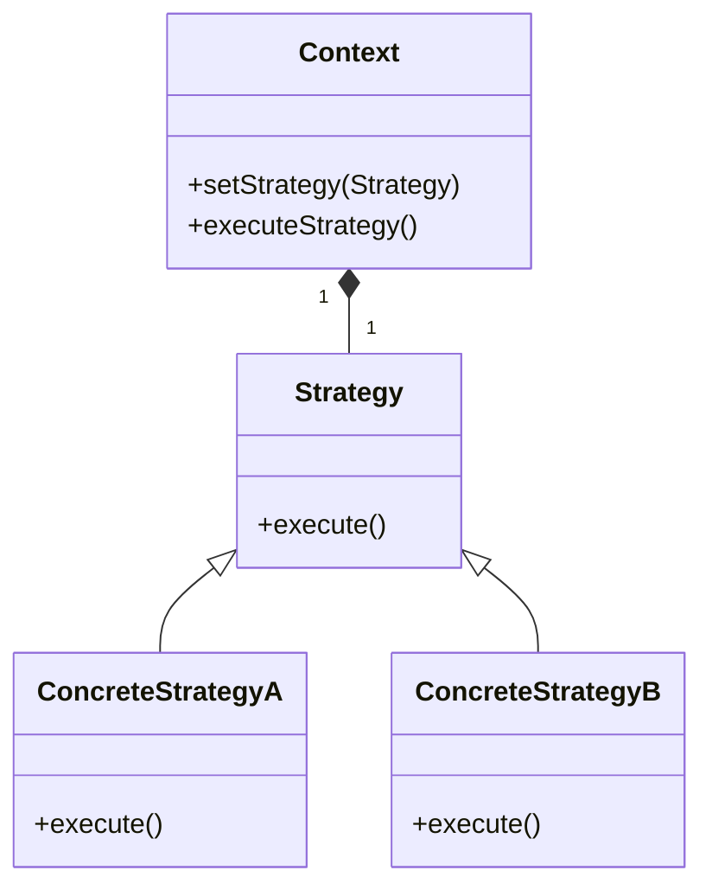

# STRATEGY

The Strategy Design Pattern is a behavioral design pattern that allows you to define a family of algorithms, encapsulate each one, and make them interchangeable. This pattern enables the algorithms to vary independently from the clients that use them, promoting loose coupling and flexibility in code.

