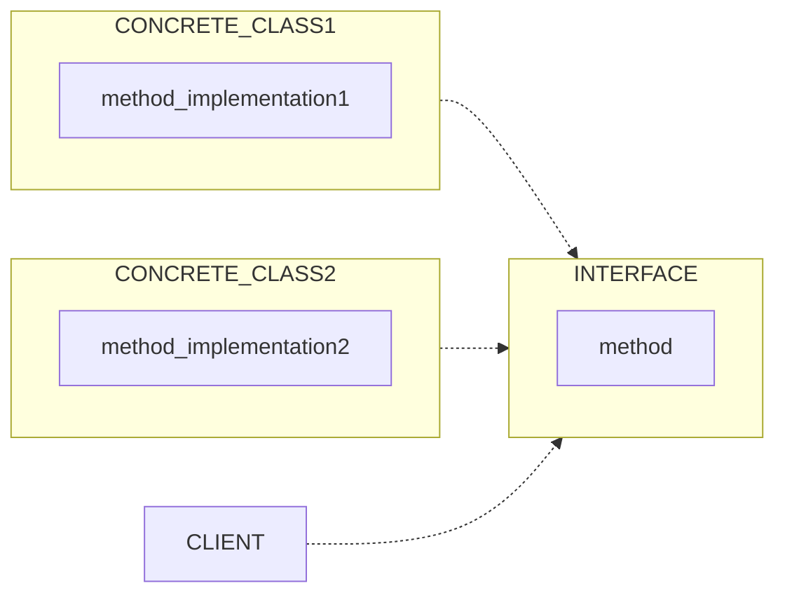

# STRATEGY

```mermaid
flowchart LR

        subgraph INTERFACE
                method
        end
    subgraph CONCRETE_CLASS1
        method_implementation1
    end
    subgraph CONCRETE_CLASS2
        method_implementation2
    end

    CONCRETE_CLASS1 -.-> INTERFACE
    CONCRETE_CLASS2 -.-> INTERFACE

    CLIENT -.-> INTERFACE
```
